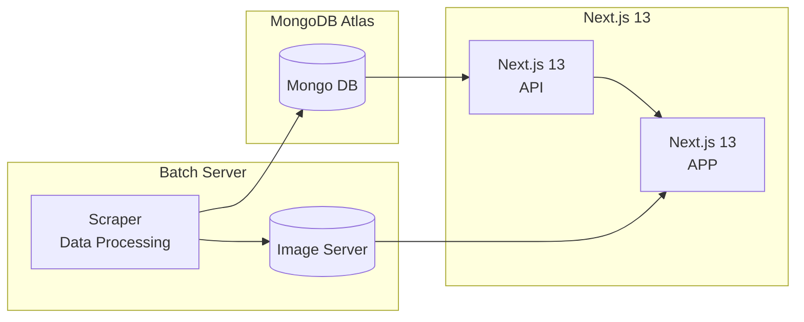

# Gachatory

## 소개

이 애플리케이션은 일본에서 발매되는 캡슐 토이의 정보를 모으고 웹에 게시합니다. 하루하루 쏟아지는 캡슐 토이 중에서 내가 좋아하는 상품의 정보는 빠르게 얻기 위해 만들었습니다.

[(Tistory) 캡슐 토이 박물관 프로젝트: 왜 만들려고 하는가?](https://marshmelona.tistory.com/26)

## 사용 기술

### Web

- Frontend: Next.js 13.4 (React), tailwindcss, TypeScript
- Backend: Next.js 13.4 (Node.js, express)
- Database: MongoDB Atlas

### Data Scraping & Image Server

- Image Server: node.js, express
- Data Scraping: Python (BeautifulSoup)
- Data Processing: Python, TypeScript

## 구조

### 설명

이 애플리케이션의 구조는 크게 3가지로 나뉩니다.

1. Batch Server
   - 캡슐 토이의 정보를 수집함 (이미지, 텍스트)
     - 텍스트는 JSON 형태로 수집됨
   - 수집한 데이터의 전처리와 후처리를 담당
     - 전처리는 DB에 삽입하기 전에 이루어짐
     - 후처리는 번역 데이터를 삽입할 때 이루어짐
   - 수집한 이미지 저장
   - DB 백업
2. DB Server
   - NoSQL, MongoDB
   - Batch Server에서 수집된 정보 중 텍스트(JSON)를 저장함
3. Web Server
   - 수집한 정보를 브라우저로 열람 가능
   - 검색 기능 지원, 다국어 기능 지원

## 작동 흐름
