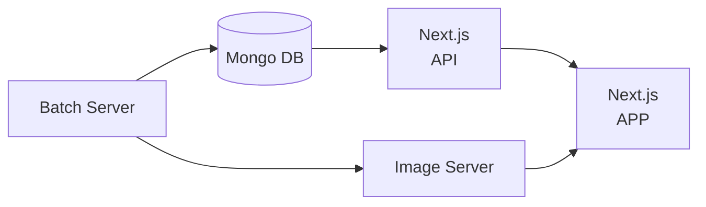

# 단계별 목표

1. 일정량 데이터 수집
2. 최소한 기능 구현
3. 최소한의 기능에 대한 UI 디자인
4. 지속적 기능 추가

# 구조도

# 프론트엔드

## 페이지 구현 관련

- 메인 페이지
  - 이번달 상품 표시 (완료)
  - 발매 예정 상품 표시
  - 검색 모달
  - 무한 스크롤
- 검색 페이지
  - URL Query (완료)
  - Pagination (완료)
  - 태그 검색 후 목록에서 선택
  - 최상단, 최하단 이동 모달
  - 날짜 선택기 (년-월)
  - 브랜드 대체 검색어
  - 상품명, 설명 검색을 합치고 OR 검색이 되도록 해야함
- 상세 페이지
  - 가챠샵 연결
  - 관련 상품 추천
    - 같은 태그를 갖고 있는 상품
  - 공유 링크 (SNS, 상세 페이지 링크)
- 마이 페이지
  - 좋아요 관리
  - 키워드 구독 목록
  - 구독 알림 목록
- 키워드 관리 페이지
  - 키워드 등록 및 삭제
- 국가별 페이지

# 백엔드 (API)

## 기능 구현 관련

## 모델 관련

- MongoDB에서 사용하는 모델의 사양을 기재
- 프론트에서 사용하는 동명의 인터페이스와는 요소가 다를 수 있음

### capsule Model

- Model 구현
  - \_id: ObejctId('')
  - brand: string
  - name: string
  - price: number
  - date: string[]
    - 재발매를 고려하여 2개 이상의 요소를 넣도록 구현
    - 최신순으로 정렬되게 삽입
  - img: string
  - description: string
  - detail_url: string
    - 데이터를 수집했던 상세 페이지
  - newest: boolean
  - tag_id: \[tag.ObejctId('')\]
  - localization_id: \[localization.ObejctId('')\]

### like Model

- 사양
  - 도큐먼트의 추가 및 삭제가 용이
  - 컬렉션 최대 크기 = 유저 수 \* 상품 수
- 발전
  - 좋아요 기반 상품 추천?
- Model 구현
  - \_id: ObejctId('')
  - product_id: capsule-toy.ObejctId('')
  - user_id: user.ObejctId('')
  - date: Date

### user Model

- Model 구현
  - \_id: ObejctId('')
  - username: string
  - email: string
  - password: string
  - subscribe: subscribe.ObejctId('')

### tag Model

- '한 상품에 달리는 태그의 수' < '한 태그에 달리는 상품의 수'이므로 capsule-toy 모델에 tag_id를 추가
- Model 구현
  - \_id: ObejctId('')
  - name: [jpn: "", kor: "", eng: ""]

### localization Model

- Model 구현
  - \_id: ObejctId('')
  - kor: [brand, name, date, description, update_date]
  - eng: [brand, name, date, description, update_date]
  - product_id: \[product.ObejctId('')\]

### subscribe Model

- Model 구현
  - \_id: ObejctId('')
  - user_id: user.ObejctId('')
  - subscribe_info: Object
    - product_id: \[product.ObejctId('')\]
    - date: Date

# 배치

## 기능 관련

- 새로운 데이터 수집
  - 수집한 데이터가 기존 데이터에 존재하는지 확인 작업 필요
  - 수집하는 사이트, 제조사마다 데이터 확인 전략이 다름
    - 트위터?
    - 자사 사이트?
    - 데이터 갱신의 주기와 방식
    - 수집을 안한 데이터는 무엇인가, 어디부터 어디까지 수집해야 하나?
  - 제조사마다 마지막으로 수집했던 날짜 확인
  -
- 태그 추가
  - capsule-toy 모델에 태그 유무 여부를 체크해야 할 듯.
  - capsule-toy 모델에서 태그가 없는 데이터만 호출
  - 텍스트에서 형태소 분석 후 기존 태그에 존재하지 않는 명사를 추출
  - 사람이 확인 후 추가할 태그 선택
    - 출력되는 데이터는 상품 ID와 태그명
    - DB에 삽입하면 편집이 불편하여 JSON을 직접 편집
  - 사람이 확인을 마친 데이터를 DB에 넣기
    - 상품 ID, 태그명 (jpn, kor, eng)

# 스크래퍼

## 자료형 관련

- detail_img는 기본 배열
- price는 숫자형
- date는 string 배열

## 스크래핑 관련

# 데이터 라벨링

## 태그

# 현지화

- 선택지는 2가지
  1. 실시간 번역 (프론트엔드에서 API 사용, DB에 저장하지는 않음)
  2. 번역 후 DB에 저장
     1. 기존의 capsule-toy 모델에는 최대한 손을 덜 대야함
     2. 새로운 모델 필요
     3. 용어집을 구성한 번역기 사용...을 하려고 했지만 deepl 용어집에 한국어가 미지원이기도 하고, 용어집 없이 번역해도 성능이 상당히 우수해서 그냥 사용.
- 시간되면 검수용 툴을 개발해야 할듯.
- 구현을 위해 이하 라이브러리를 사용
  - [참고](https://locize.com/blog/next-13-app-dir-i18n/)
  - i18next
  - react-i18next
  - i18next-resources-to-backend
